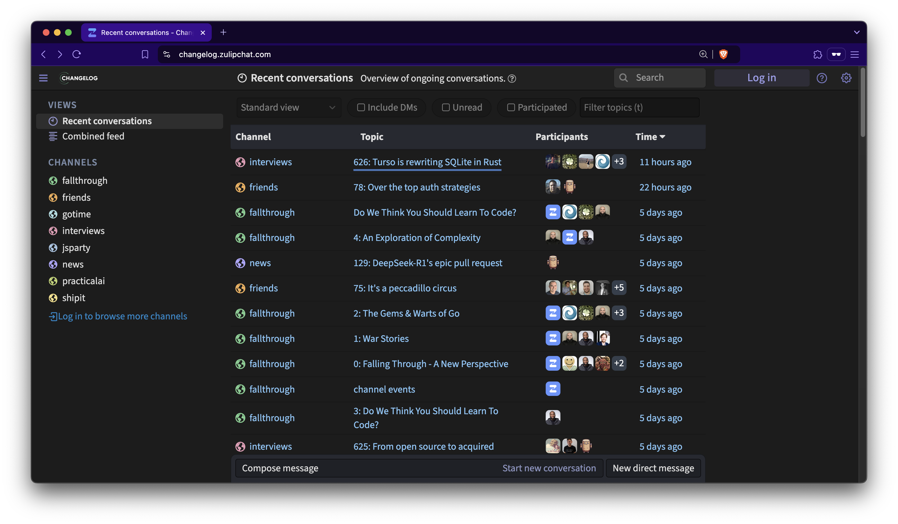

# The Pipe Dream™️

A single-purpose, single-tenant CDN for [changelog.com](https://changelog.com).
Runs [Varnish Cache](https://varnish-cache.org/releases/index.html) (open
source) on [Fly.io](https://fly.io/changelog). This repository exists for a
single reason: build the simplest CDN on [Fly.io](https://fly.io/changelog).
You are welcome to fork it and make it your own. OSS FTW 💚

## How it started

> I like the idea of having like this 20-line Varnish config that we deploy
> around the world, and it’s like “Look at our CDN, guys.”
>
> It’s so simple, and it can do exactly what we want it to do, and nothing
> more.
>
> But I understand that that’s a <strong>pipe dream</strong>, because that
> Varnish config will be slightly longer than 20 lines, and we’d run into all
> sorts of issues that we end up sinking all kinds of time into.
>
> 🧢 Jerod Santo - March 29, 2024 - <a href="https://changelog.com/friends/38#transcript-208" target="_blank">Changelog & Friends #38</a>

## How is it going (a.k.a. Roadmap)

- [x] Static backend, 1 day stale, stale on error, x-headers - `46` lines of VCL - [Initial commit](https://github.com/thechangelog/pipedream/commit/17d3899a52d9dc887efd7f49de92b24249431234)
- [x] Dynamic backend, cache-status header - `60` lines of VCL - [PR #1](https://github.com/thechangelog/pipedream/pull/1)
- [x] Add tests - `60` lines of VCL - [PR #3](https://github.com/thechangelog/pipedream/pull/3)
- [ ] Add feeds backend: /feed -> http://feeds.changelog.place/feed.xml
- [ ] Send logs to Honeycomb.io (same structure as Fastly logs)
- [ ] Send logs to S3 (for stats)
- [ ] Implement purge across all app instances (Fly.io machines)
- [ ] Add edge redirects from [Fastly service](https://manage.fastly.com/configure/services/7gKbcKSKGDyqU7IuDr43eG)

## How can you help

If you have any ideas on how to improve this, please open an issue or go
straight for a pull request. We make this as easy as possible:
- All commits emphasize [good commit messages](https://cbea.ms/git-commit/) (more text for humans)
- This repository is kept small & simple (single purpose: build the simplest CDN on Fly.io)
- Slow & thoughtful approach - join our journey via [audio with transcripts](https://changelog.com/topic/kaizen) or [written](https://github.com/thechangelog/changelog.com/discussions/categories/kaizen)

See you in our [Zulip Chat](https://changelog.zulipchat.com/) 👋

> [!NOTE]
> Join from <https://changelog.com/~> . It requires signing up and requesting an invite before you can **Log in**

## Contributors

- [James A Rosen](https://www.jamesarosen.com/now), Staff Engineer
- [Matt Johnson](https://github.com/mttjohnson), Senior Site Reliability Engineer
